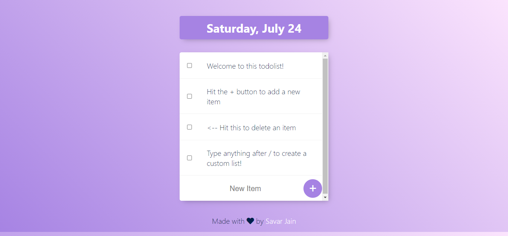
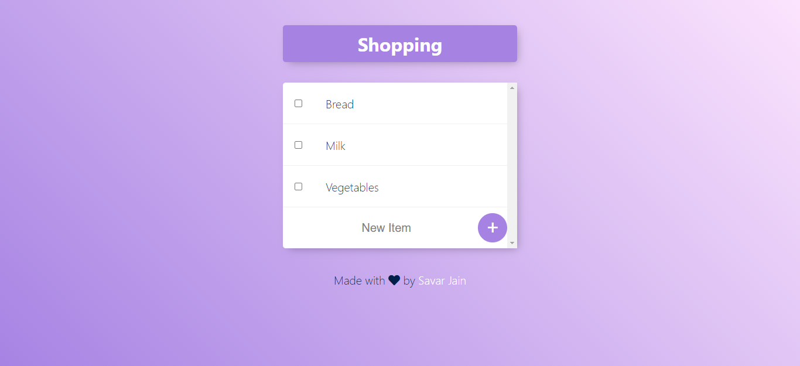

# **Todolist App**

A full stack and fully responsive Todolist web app that allows users to add and delete items when completed. The user can also create multiple todolists such as Work or Shopping simply by adding the name of the new list after the `/` in the url

## **Table of Contents**

- [Deployment](#deployment)
- [Built With](#built-with)
- [Requirements](#requirements)
- [Install](#install)
- [Author(s)](#authors)
- [License](#license)
- [Acknowledgement](#acknowledgements)

 

## Deployment

**[Live Demo: https://savarj-todolist.herokuapp.com/](https://savarj-todolist.herokuapp.com/)**

- Create **_multiple_** todolists!
  - Example: [https://savarj-todolist.herokuapp.com/Shopping](https://savarj-todolist.herokuapp.com/Shopping)

 

 

## Built With

- [HTML](https://developer.mozilla.org/en-US/docs/Web/HTML)
- [CSS](https://developer.mozilla.org/en-US/docs/Web/CSS)
- [Node.js](https://nodejs.org/en/docs/)
- [Express.js](https://expressjs.com/en/5x/api.html)
- [MongoDB](https://docs.mongodb.com/drivers/node/current/)
- [Mongoose](https://mongoosejs.com/docs/)
- [EJS](https://ejs.co/)

## Requirements

For development, you will only need Node.js and a node global package, NPM, installed in your environement.

### Node

- #### Node installation on Windows

  Just go on [official Node.js website](https://nodejs.org/) and download the installer. Also, be sure to have `git` available in your PATH, `npm` might need it (You can find git [here](https://git-scm.com/)).

If the installation was successful, you should be able to run the following command.

    $ node --version
    v14.17.0

    $ npm --version
    6.14.13

## Install

    $ git clone https://github.com/SavarJ/todolist.git
    $ cd todolist
    $ npm install

### Running the project

    $ npm start

### Updating .env

Rename `.env.sample` to `.env` with the appropriate information

## Author(s)

- **[Savar Jain](https://jainsavar.com)**

## License

Copyright (c) 2021 Savar Jain

Licensed under the [MIT License](LICENSE)

## Acknowledgement

- The Complete 2021 Web Development Bootcamp by Dr. Angela Yu
